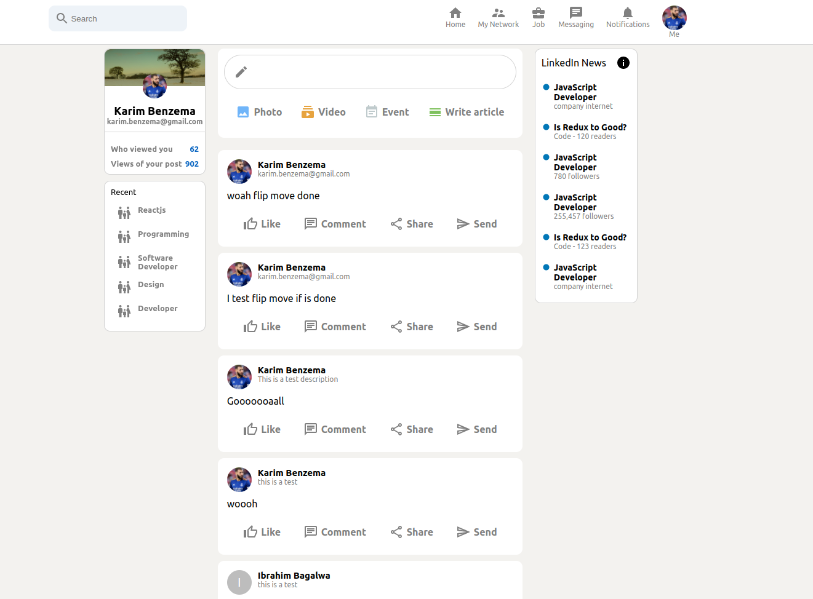

# LinkedIn-clone App

## Welcome! 👋

This is a linkedIn clone app 
If you already have an account you only want to enter your email and password and click on connect
otherwise you must create an account by putting the link of your image and click on register now.

post your comments to be able to help us thank you

## Content

- [Screenshot](#screenshot)
- [Links](#links)
- [Built with](#built-with)
- [Author](#author)
- [Contact Us](#contact-Us)

### Screenshot

### Links

- Live Site Demo URL: [LinkedIn Clone](https://linkedin-clone-6222c.web.app)

### Built with

- React
- Redux
- Firebase

## Author

- Ibrahim Bagalwa - [@ibrahim_Bagalwa](https://twitter.com/ibrahim_Bagalwa))
- LinkedIn - [ibrahim-bagalwa](https://www.linkedin.com/in/IbrahimBagalwa)
## Contact Us

   
___

